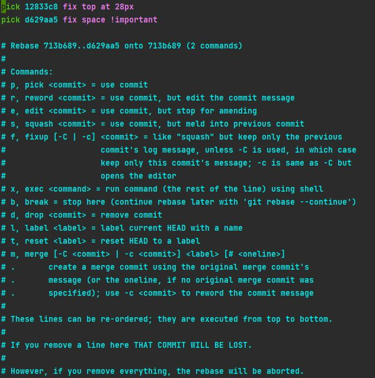

# Wikigit

- [Log](#log)
- [Status](#status)
- [Pull](#pull)
    - [Pull with rebase](#pull-with-rebase)
- [Commit](#commit)
    - [Revert](#revert-commit)
    - [Checkout](#checkout-to-commit)
- [Rebasing](#rebasing)
    - [Abort](#abort-rebase)
- [Interactive rebase](#interactive-rebase)
- [Diff](#diff)
- [Stash](#stash)
    - [Save](#save)
    - [List](#list)
    - [Apply](#apply)
    - [Drop](#drop)
    - [Pop](#pop)
    - [Clear](#clear)
- [Push](#push)
    - [Push with rebase](#push-with-rebase)
- [Tag](#tag)
    - [Describe](#describe)

---
<div id='log'/>

## Log

```cmd
git log
```

Show the commits history and some details.list

---

<div id='pull'/>

## Pull

```cmd
git pull
git pull --merge
```

If you pull remote changes with the flag --merge, which is also the default, then your local changes are merged with the
remote changes. This results in a merge commit that points to the latest local commit and the latest remote commit.

---

<div id='pull-with-rebase'/>

### Pull with rebase

```cmd
git pull --rebase
```

If you pull remote changes with the flag --rebase, then your local changes are reapplied on top of the remote changes.

---

<div id='commit'/>

## Commit

```cmd
git commit -m <"add commit message here..">
```

Do a commit.

---

```cmd
git commit -m <"add commit message here.."> --no-verify
git fcommit -m <"add commit message here..">
```

The flag --no-verify Avoid pre-commit checks.

---

<div id='revert-commit'/>

### Revert

```cmd
git revert <hash-commit>
```

Remove a specific commit.

---

<div id='checkout-to-commit'/>

### Checkout

```cmd
git checkout <hash-commit>
```

Switch to specific commit.

---

<div id='interactive-rebase'/>

## Interactive rebase

```cmd
git rebase -i HEAD~<number_of_commits_to_show>
```

Interactive functionality for managing of the commit.



1) entered the interactive mode digit "i" for enter in edit mode.
2) replace the word "pick" with one of the key in the legend below.
3) digit the button "esc" for exit from edit mode.
4) digit :wq for confirm the modifications or :q for abort the modification.

```cmd
git reset --hard ORIG_HEAD
```

5) for revert a rebase.

---

<div id='rebasing'/>

## Rebasing

```cmd
git rebase <name_branch>
git rebase <remote_name> <name_branch>
```

wip..

---

<div id='abort-rebase'/>

### Abort

```cmd
git rebase --abort
```

Cancel rebase.

---

<div id='diff'/>

## Diff

```cmd
git diff
```

Show the eventually modifications.

---

<div id='stash'/>

## Stash

```cmd
git stash
git stash push
```

Save the local changes, reporting the state of the branch to the state of the HEAD commit.

---

<div id='save'/>

### Save

```cmd
git stash save <"add a stash message here..">
```

Create a stash with a specific message.

---

<div id='list'/>

### List

```cmd
git stash list
```

Show the list of stashes. Example of result:

```cmd
output:
stash@{0}: On Nome_Branch: Messaggio..
```

{0} show the index assign to the specific stash

---

<div id='apply'/>

### Apply

```cmd
git stash apply <stash@{0}>
```

Get a specific stash by index (stash@{0}). NB. this stash won't delete.

```cmd
git checkout -- .
```

Remove the modification of the last stash applied.

---

<div id='drop'/>

### Drop

```cmd
git stash drop <stash@{0}>
```

Remove a specific stash from index (stash@{0}). NB. this command removes the stash without applying the changes.

---

<div id='pop'/>

### Pop

```cmd
git stash pop
```

Remove the stash at TOP position of the list. ({0})
NB. this command removes the stash applying the changes.

```cmd
git stash pop <stash@{0}>
```

Remove the specific stash from index, applying the modifications.

---

<div id='clear'/>

### Clear

```cmd
git stash clear
```

Remove all the stashes

---

<div id='push'/>

## Push

```cmd
git push
```

Send the modifications in the repository.

---

<div id='push-with-rebase'/>

### Push with rebase

```cmd
git push --force-with-lease
```

Send the modifications in the repository, without overwrite any work on the remote branch if more commits were added to
the remote branch. maintaining a linear history.

---

<div id='tag'/>

### Switch to Tag

```cmd
git checkout <name_tag> 

exapmle: git checkout 1.0.12 
```

Move to specific Tag.

---

<div id='describe'/>

### Describe

```cmd
git describe --tags 
```

Move to specific Tag.

---